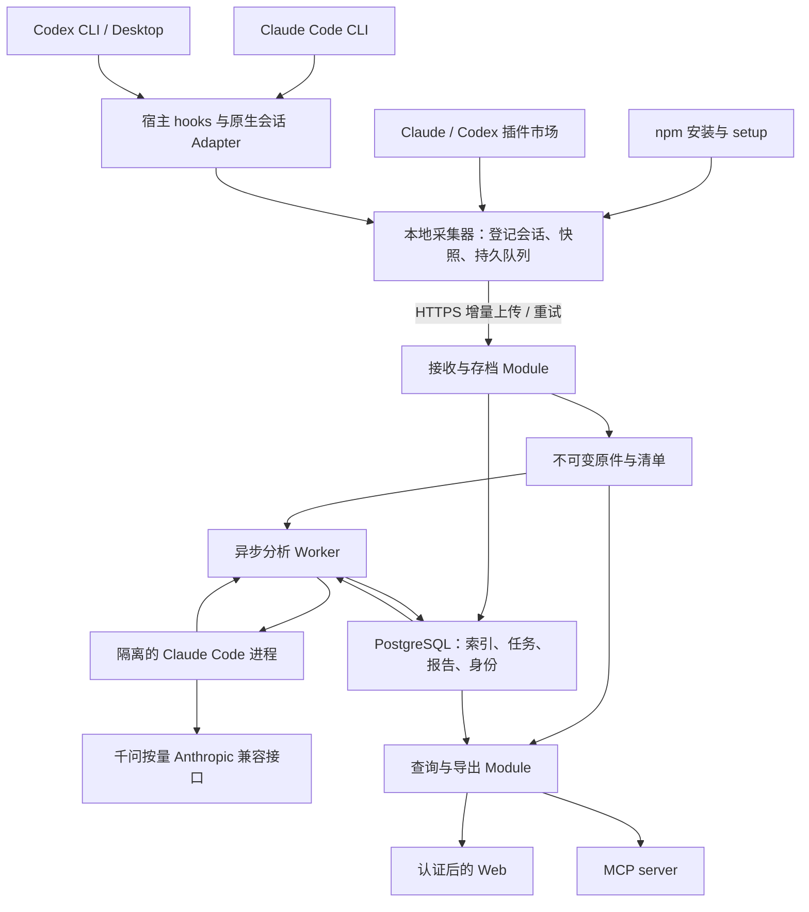

# Skynet 可行性分析与整体架构

日期：2026-09-24。状态：用户已确认本设计，已合成为 [PRD v1.0](../requirements/PRD.md)；尚未实现、部署或完成兼容性实测。文中的建议选型作为已接受的实现方向，能力支持仍以实验为准；产品实施与验收以 PRD 为依据。

配套：[员工安装设计](./installation-design.md)、[技术验证计划](./validation-plan.md)、[采集研究](../research/2026-09-24-agent-activity-observability.md)、[安装渠道研究](../research/2026-09-24-npm-onboarding-feasibility.md)。

## 1. 结论和推荐

**整体有条件可行。推荐“统一的本地采集器 + Agent hooks/原生会话 Adapter + 单机可部署的平台 + 独立 Claude Code 分析进程”。npm 和各 Agent 插件市场可以作为不同安装入口，共用同一份设备身份、队列和后台。**

最重要的技术验证是 Codex CLI/Desktop 的完整原生恢复，以及不同宿主版本对活动事件和原始记录的实际覆盖。完成这些验证前，可以确认有可行的系统结构，不能承诺已经实现全部客户端的无损续聊。

| 需求 | 判断 | 依据或限制 |
| --- | --- | --- |
| npm 安装、员工只提供一个授权值 | 可设计实现 | 企业发行配置内置平台地址；显式 setup 负责注册。npm 安装脚本不是可靠的初始化保证 |
| 从 Agent 插件市场安装 | 可作为另一发行入口 | Claude/Codex 提供插件机制；后台生命周期和一次绑定仍要实现，插件安装不等于数据已同步 |
| 员工日常无需填报或主动上传 | 可设计实现 | 宿主活动事件触发、后台读原生记录、持久队列上传；不依赖模型主动调用 MCP |
| 覆盖 Claude CLI、Codex CLI/Desktop | 官方机制提供基础，需按版本实测 | 用户级配置、hook 信任、桌面加载时点及事件覆盖不能只凭配置相同推定 |
| 全项目；只采集新会话和被继续使用的旧会话 | 可设计实现，活动识别是验证点 | 通过可信的宿主活动信号登记；旧会话一旦继续，补齐该会话全部可获得记录 |
| 原件存档、可读导出 | 可设计实现 | 原件按字节保存，解析失败仍可存档；上游已删除或未保存的内容不能补造 |
| 导出后回原 Agent 继续聊天 | Claude 有官方路径；Codex 是首要验证门槛 | 恢复文件、必要索引、版本兼容、附件和父子会话均需演练 |
| 日报/周报、有证据的工作总结 | 可设计实现 | Claude Code 异步分析，所有关键结论带原文定位，人工更正保留版本 |
| 证明精确人工工时或不可抵赖绩效 | 不由本方案保证 | 原生会话记录是工作过程材料；活动量、token、Agent 运行时长不等于人工投入或成果质量 |

官方能力依据：[Claude hooks](https://code.claude.com/docs/en/hooks)、[Claude 会话恢复](https://code.claude.com/docs/en/sessions)、[Codex hooks](https://learn.chatgpt.com/docs/hooks)、[Codex 插件](https://developers.openai.com/plugins/build/plugins)、[npm 脚本生命周期](https://docs.npmjs.com/cli/v12/using-npm/scripts/)。更细的适用范围见两份研究报告。

## 2. 整体结构



员工电脑只运行短 hook 和本地采集后台。平台先持久化原文，再异步解析、归类和分析；模型不可用时，原始记录仍能接收、查看和导出。

**MCP 是平台的查询入口，不是被动监听所有 Agent 活动的协议。** hooks 负责发现活动，原生文件提供完整材料，后台负责可靠传输。平台的 MCP 与 Web 复用同一套查询和证据定位逻辑。

### 首版部署与技术选择

| 位置 | 建议 | 理由 |
| --- | --- | --- |
| 员工端 | TypeScript / Node LTS；先以 Node 24 验证 | npm 分发自然，客户端和平台共享上传契约；初版避免依赖本地编译 |
| HTTP/MCP 入口 | Node + TypeScript + Fastify；MCP 使用官方 SDK | HTTP、身份、收件和查询放在同一个应用进程，降低内部部署维护成本 |
| Web | React + Vite，构建为静态文件 | 内部工作台以查询和证据阅读为主，首版不依赖 SSR |
| 数据库 | PostgreSQL | 保存身份、上传清单索引、解析事件、分析任务与报告版本 |
| 原始数据 | Linux 持久卷上的不可变分块文件 | 单机首版容易运维；不把大段工具输出塞入频繁查询的关系表 |
| 分析 | 独立 Worker 进程/容器，启动 Claude Code 作业 | 与上传、查询隔离；模型慢、失败或超额时不阻塞原件入库 |
| 部署 | Docker Compose：HTTPS 入口、应用、数据库、Worker、持久卷 | 先完成一台 Linux 服务器的可重复部署；数据库不直接暴露到外网 |

这些是建议选型，不是已测吞吐结论。Node 发布信息、Fastify 与 Compose 的能力分别见[Node](https://nodejs.org/en/about/previous-releases)、[Fastify](https://fastify.dev/docs/latest/)、[Compose](https://docs.docker.com/compose/)。原始存储容量不足时再评估对象存储；首版不同时引入 Redis、Kafka、Elasticsearch、向量数据库或多集群。

服务端先采用**模块化单体**，分析 Worker 单独运行但共用仓库与契约。按职责拆 Module，不按每一张表拆成独立部署。真实需要变化的 Seam 是 Claude/Codex 原生格式、不同 OS 的启动机制和分析执行环境。

## 3. Module 与 Interface

表中的 Interface 包括操作、顺序和失败语义，不只是 TypeScript 类型。公开契约控制在少数业务操作；路径规则、重试和版本解析留在 Implementation 内。

| Module | 主要 Interface | 隐藏的 Implementation / 约束 |
| --- | --- | --- |
| Enrollment & Runtime | `setup`、`status`、`repair`、`uninstall` | 设备身份、两个安装渠道、用户后台、配置合并和回滚；重复执行不增加实例 |
| Agent Integration | `detect`、`install`、`observe`、`snapshot`、`restore` | Claude/Codex Adapter 及版本配置；输出能力状态和缺口，不返回假完整结果 |
| Local Capture & Delivery | `record`、`sync`、`health` | 采集资格、原件快照、本地持久化、重试、上传游标；不让网络请求进入宿主关键路径 |
| Archive | `acceptChunk`、`commitManifest`、`readSnapshot`、`export` | 字节校验、落盘次序、幂等、不可变版本；只有已提交的清单才能读取为完整快照 |
| Evidence | `projectSnapshot`、`queryEvents`、`resolveEvidence` | 版本化解析、去重、原件偏移、时间和归属；不覆盖原件 |
| Analysis | `requestAnalysis`、`getStatus`、`getResult` | 作业队列、租约、Claude Code 调度、输入快照、结构化校验、重试和费用限额 |
| Reporting | `readPeriod`、`correct`、`regenerate` | 工作主题聚合、日周版本、迟到数据、人工更正、证据链 |

Web 和 MCP 调用同一个 Reporting / Evidence Interface。不同入口不分别实现一套统计。原件文件 Implementation 先具体实现，不为暂时不存在的多云后端添加一层通用存储框架。

建议仓库布局：

```text
apps/
  collector/        # 员工 CLI、hook launcher、本地后台
  server/           # 注册、收件、查询、导出、MCP
  worker/           # 解析任务与 Claude Code 作业协调
  web/              # 内部工作台
packages/
  contracts/        # 上传、清单、结构化分析结果的版本契约
  agent-adapters/   # Claude / Codex 格式与宿主集成
  domain/           # 会话、证据、报告的规则
plugins/
  claude/           # 薄发行入口，共用 collector
  codex/            # 薄发行入口，共用 collector
deploy/            # Compose、部署配置模板
docs/
```

这不是要求立刻创建所有包；实现时按首条验证链逐步落地。插件入口不复制完整采集逻辑。

## 4. 采集与原件存档

### 4.1 资格登记：避免误导入历史

首次 setup 不批量上传会话目录。宿主事件证明某个会话在接入后启动或继续使用，采集器才将它登记为受跟踪会话。后台以后只核对已登记路径，以及 Adapter 明确识别出的必要父子关联材料。

旧会话被继续使用时，**首次上传从该会话现存原件的开头开始**，然后增量同步。已经在接入前被清理、截断或仅存在于上游云端但无法取得的记录，明确显示缺口。不得把 compact 后的摘要冒充原始全文。

接入前内容保留其原始时间，作为上下文证据展示。建议日/周活动按事件发生时间计入：本次补传的旧内容不伪装成今天的新增工作，也不因第一次上传很大的旧会话增加今天的活动量。是否补生成从未覆盖的古老日报不属于自动历史导入；首版默认只更新已管理的报告期间，并展示历史上下文。

恢复到另一设备或复制会话可能再次看到相同材料。通过来源会话身份、文件代次、原件位置和谱系识别重传；不能只靠文本哈希去重，因为两次真实工具调用可能内容完全相同。

### 4.2 本地采集

1. hook 校验少量事件字段，生成稳定事件 ID，写入当前用户的持久 spool 后尽快返回。
2. 后台消费 spool，发现或更新受跟踪会话，按原生格式取得完整文件集合和变更范围。
3. 对文件增长保存增量分块；对截断、重写或 compact 建立新文件代次，保留服务器上已有旧代次。
4. 原始字节与解析分离。JSONL 尚未写完的最后一行可作为原件字节暂存，未闭合前不当作完整业务事件。
5. 后台定时核对受跟踪文件，弥补文件监听漏事件；不能只依靠 SessionEnd 或进程正常退出。
6. 持久队列在网络错误、进程退出和系统重启后继续；磁盘不足或读取失败显示缺口，不声称零丢失。

不全盘扫描，不把整个 `.claude` / `.codex` 目录打包上传。Adapter 明确列出会话原件、关联附件和恢复必需的材料；账号登录状态、模型 Key、设备凭据不属于会话备份。完整会话本身可能包含员工输入的敏感内容，按已确认的全量采集范围存档。

### 4.3 上传和 ACK 语义

采用**至少一次传输 + 服务端幂等提交**，不承诺网络层恰好一次。

```text
本地持久 spool
  → 提交缺失分块（长度、哈希、协议版本）
  → 服务端暂存、校验、刷新、原子发布原件
  → 提交会话快照清单（文件代次、字节范围、关联材料）
  → 数据库事务登记清单及后续任务
  → 返回已提交版本的 ACK
  → 客户端推进已确认游标
```

清单只引用已经持久化且校验通过的分块。网络重试使用相同幂等键；同一键不同内容报冲突。原件落盘后数据库提交失败，产生可清理的孤立分块；清理要留宽限期，不能删仍有上传租约或清单引用的数据。数据库提交后 ACK 丢失，重试返回既有提交结果。

ACK 表示数据已按本部署的持久存储约定接收，**不自动代表异地容灾副本已经建立**。服务器必须分别备份数据库和原始持久卷，并做一致性恢复演练；未部署第二份备份时，页面如实展示单副本状态。员工端仅清理已确认的上传载荷；未确认队列的限额、告警与处理策略须可见。

## 5. 核心数据结构

| 记录 | 核心字段与用途 |
| --- | --- |
| Employee / Device | 员工身份、安装环境、独立设备凭据、最后心跳；服务端决定归属 |
| SourceInstance | Agent 类型、版本、运行环境、配置根标识；区分本机、WSL、SSH、容器 |
| Session | 来源会话 ID、来源实例、项目、首次登记时间、原始时间范围、父/分支关系、完整性状态 |
| Artifact / Chunk / ManifestRevision | 原生文件标识、代次、分块哈希和长度、快照覆盖范围、缺失材料、可恢复能力 |
| Event | 来源位置、事件类型、时间、已观察数据；解析版本与对应清单版本 |
| WorkTopic / TopicLink | 同一员工/项目下跨会话主题及其证据；模型归类可被人工更正 |
| AnalysisRun | 输入快照、模型及运行时版本、提示版本、状态、尝试次数、实际可得用量、结果 |
| ReportRevision / Correction | 人员、期间、时区、引用的分析版本、更正、操作者和生成时间 |

来源身份不能只使用本地用户名或未限定范围的 session_id。统计身份包括员工、来源实例和会话谱系；恢复出的历史保留原始归属，新的工作按当前设备身份记录。跨设备拷贝无法确认关系时先标记待去重，不能默默合并两个不同员工的工作。

原件、解析结果和 AI 结论三者分别版本化。重新解析或更换模型不覆写原件；人工更正不修改原始日志。

## 6. Claude Code 分析流水线

### 6.1 调度

上传成功后先执行轻量解析，让原文和活动列表可见。分析按会话增量去抖，同一个范围出现多个新版本时合并等待任务，避免每个 hook 都启动一次模型。日报每日 09:00、周报周一 09:00，按 Asia/Shanghai 调度；迟到数据重新生成对应版本。

任务队列先用 PostgreSQL。短事务通过 `FOR UPDATE SKIP LOCKED` 领取任务，写入租约和尝试 ID 后释放事务；模型运行期间不持有数据库行锁。Worker 心跳续租，超时可重试。该语法适合多消费者队列取件，但不是恰好一次执行保证。[PostgreSQL SELECT 文档](https://www.postgresql.org/docs/current/sql-select.html)

作业结果通过“范围 + 输入版本 + 分析配置版本”标识。过期租约或旧输入的结果可以保留为历史，但不能覆盖更新报告；失败采用退避、次数上限和可见的待处理状态。解析与模型任务使用独立并发额度，长模型任务不能堵住一分钟原文可见目标。

### 6.2 执行

每次分析为 Claude Code 提供独立工作目录、确定的原件快照和必要的只读证据工具。运行配置不加载员工项目中的指令、hooks 或凭据；会话里出现的命令与提示均作为被分析材料，不能成为执行命令的授权。Worker 不提供 shell 执行员工命令、改仓库或外发消息的工具，也不挂载 Docker socket。

使用 Claude Code 的非交互能力，按已确认的千问按量接口运行；结构化输出、可用工具限制和 provider 兼容性必须通过样机验证，不能只因为启动成功就判定分析通过。[Claude 非交互文档](https://code.claude.com/docs/en/headless)、[用户指定的千问 Claude Code 文档](https://platform.qianwenai.com/docs/developer-guides/clients-and-developer-tools/claude-code)。

大型会话按稳定证据位置切分，先提取局部事实，再聚合会话、主题、日与周。每一层保留原文引用，不只有上一级摘要；读取不全、上下文截断和模型失败都进入结果状态。模型费用通过并发、作业时间、输入规模和预算限额控制，具体模型与金额部署时设定。

平台自身分析会话标记为系统任务，不能再次被员工采集链计入，避免循环采集。

### 6.3 输出契约

建议结构化结果至少包括：目标、工作主题、关键行动、结果、阻塞、待继续事项、证据引用和不确定项。每个结果区分：

- **记录已观察到：** 例如工具结果显示测试通过，附对应调用、退出结果和位置。
- **Agent 或用户声称：** 例如“已经上线”，但会话没有部署结果支撑。
- **模型推断：** 例如跨会话可能属于同一任务，允许人工改归类。
- **材料不足：** 例如缺失工具输出、未采集到会话前半段。

活动统计优先使用确定性解析：会话数、用户轮次、工具调用数、出现的文件、可取得的 token 用量及事件活跃区间。缺失字段显示未知，不填 0。并发会话不能把时长相加当人工工时；token、文本量和修改次数不能直接转成员工价值或 AI 评分。

服务器的不可变存档、哈希和版本可以检查收到之后的变化，不能证明员工机器上的原始记录从未编辑。这是证据解释的实际限制。

## 7. Web 与 MCP

### Web 页面

| 页面 | 首版重点 |
| --- | --- |
| 团队概览 | 今日/本周人员与项目分布、工作主题、阻塞，以及同步覆盖和分析状态 |
| 员工日/周工作 | 按项目→主题展开目标、过程、结果、下一步、证据和统计；切换历史版本 |
| 会话详情 | 用户/Agent/工具时间线、原件引用、搜索、缺口提示、完整导出和恢复说明 |
| 接入与设备 | npm / 插件市场入口、个人接入 Key、配置/信任/首次采集/上传各状态、诊断与撤销 |
| 更正与存储 | 补充说明、主题改归类、重新生成；原件占用、备份状态、失败任务 |

默认列表不要自动加载全部大体积工具输出；按需展开，但原件与导出保持全量。报告点击证据应直达对应会话位置。首页应区分“没有工作记录”与“设备离线/待信任/采集缺口”。

### MCP

采用平台 HTTPS 下的 `/mcp`，使用 Streamable HTTP，复用 server 进程中的查询 Module。需要通过 MCP 查询数据的人员使用浏览器登录授权，将访问令牌绑定到既有个人账号；上传设备不因此取得全量读权限。按 MCP 的 HTTP 授权规范接入 OAuth、资源元数据和令牌受众校验，不把 Web cookie、MCP 会话 ID 或设备 Key 直接当成可互换凭据。[MCP 传输规范](https://modelcontextprotocol.io/specification/2025-11-25/basic/transports)、[MCP 授权规范](https://modelcontextprotocol.io/specification/2025-11-25/basic/authorization)。

这是查询用途的首次登录，不增加员工自动采集的日常步骤或第二个安装环境变量。首版只选定并实测目标客户端支持的协议/授权版本，不先实现所有历史传输兼容路径。

首版建议工具：`search_sessions`、`read_session`、`get_employee_report`、`get_evidence`、`prepare_export`。分页与大小限制属于 Interface；不让单次响应塞入整个月的所有会话。Web 和员工 MCP 认证后按用户决定可读全部数据。

设备上传凭据只用于注册设备的写入；不凭客户端传来的员工 ID 改归属。分析进程使用作业范围的证据读取凭据，减少一次模型任务无意读取全部历史；这不改变 Web 的全员共享查看规则。首版不引入按团队/员工隔离读取的角色体系。

## 8. 导出与原生恢复

提供两种导出：便于阅读的完整会话包，以及含原生材料、来源版本、清单、哈希和恢复说明的原生恢复包。两者均不意味着恢复员工代码工作区、依赖、进程或 Agent 账号登录状态。

员工通过拟定的 `skynet restore` 选择会话、快照和目标位置。先下载到隔离目录，校验清单，检查目标 Agent 与版本，再由对应 Adapter 执行已验证的恢复步骤；默认不覆盖现有同 ID 会话或正在使用的状态数据库。

Claude 已有从会话记录恢复的官方入口，仍需验证子会话、附件及不同路径。Codex 需要实验确认原件与索引之间的依赖、CLI/Desktop 可见性和原生继续对话路径。**把全文重新塞进一个新提示词不算原生恢复通过。**

恢复能力按“Agent + 版本 + OS + 运行环境”记录。若 Codex 原生恢复未通过，必须将其列为首版需求未满足，重新评估设计或支持版本；不能仅提供 Markdown 下载就宣称已满足用户要求。

## 9. 安装体验：两种入口，一套后台

首选 npm 路径：`npm install -g <组织包>` → 设置 `SKYNET_KEY` → `skynet setup` → 必要的宿主信任。setup 自动检测客户端、绑定员工、安装适配、配置用户后台和自检。员工不手写 JSON/TOML、不填平台 URL、不配模型 Key。

插件市场路径：安装组织发布的 Skynet 插件 → 一次身份绑定/初始化 → 必要的宿主信任 → 后台自动工作。Claude 与 Codex 分别有薄插件入口；在多个宿主安装时，共用已绑定后台，不重复上传。若需要授权输入，优先让本地初始化程序读取环境变量或掩码输入，不让 Key 经过模型对话。

插件能否直接携带对应平台运行文件、是否还需 Node、首次初始化怎样从 UI 启动以及更新/卸载的行为，按官方能力和实机验证决定。不能将“插件市场安装成功”解释为“后台已注册”。在没有 Node 的员工设备上，插件携带预构建运行产物可能更省事，但需要增加各 OS/架构构建和签名维护，不能默认免费获得。

**建议优先实现一个统一采集核心，先用 npm 验证完整安装链；插件市场作为并列发行入口验证。** 如果试点表明插件安装交互明显更少，则将其作为 Web 推荐入口。无需因选择市场而重写采集和服务端，也无需为了试验先实现两套后台。详细步骤、状态、升级与卸载见[安装设计](./installation-design.md)。

## 10. 容量、运维与未决事实

原件默认长期保留，因此容量主要取决于每日原始字节、附件、重写版本和备份副本。以**纯示例**的 50 人、每人每天 20 MB 原始增量计算，每日约 1 GB、全年约 365 GB，尚未计副本、数据库、附件超额和压缩；这不是对本团队数据量的估计。

先从少量合成记录和试点测出实际分布，再决定磁盘、模型预算、并发与服务器规格。大文件使用分块和限流，恢复旧会话全量同步不应挤掉其他人的实时小增量。安装页可以先显示“已接入，历史上下文正在同步”，直到清单确认完整才显示“已完整备份”。

需要观察的运行指标：最后成功采集/上传时间、队列字节和最老积压、解析失败、原件缺口、任务年龄、分析失败/用量、数据库与原件卷容量、服务器备份时间。所有这些属于产品可靠性状态，不是员工绩效指标。

目前尚缺实际员工 OS/版本分布、人数、网络条件、是否使用 WSL/SSH/容器、服务器磁盘和备份配置。这些不阻止完成架构设计，但不能据此虚构平台容量或全部兼容性。正式试点时登记即可。

## 11. 实施顺序

1. **先验证高风险假设：** 三个入口的活动识别、完整原件捕获和原生恢复，尤其 Codex Desktop。
2. **打通最小可靠链：** 一次安装/绑定 → 合成事件 → 持久队列 → 原件提交 → ACK → 可读导出；包含断网和重启。
3. **实现查询与证据：** Web 会话详情、设备状态、MCP 查询和基本统计，先能看到真实材料。
4. **接入分析：** Claude Code + 千问按量、结构化证据、主题归并、日报/周报、纠错版本。
5. **完成发行与试点：** npm 和市场入口验证、升级/卸载、普通用户权限、备份恢复与实际负载。

各阶段有明确通过条件，见[技术验证计划](./validation-plan.md)。本轮交付架构与实验设计，没有发布包、安装后台、采集真实会话或调用付费模型。
