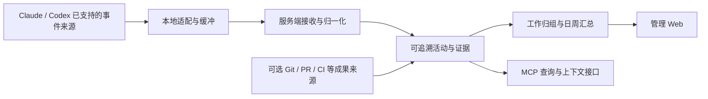

# Coding Agent 工作观察平台：需求探索

日期：2026-09-24。状态：三轮建议及 Q16 修订已确认，产品范围已收敛；尚未进入产品实现。

**当前范围与待决事项以 [v1-scope.md](./v1-scope.md) 为准。** 本文保存访谈演进，下面的第一、二轮建议和当时的未知项均为历史记录，不覆盖后续用户决定。

关联文档：[术语表](../../CONTEXT.md)、[一手资料研究](../research/2026-09-24-agent-activity-observability.md)。

## 第三轮回答与后续修订

用户答复：`全部按建议;QwenTokenPlanCn 接入ClaudeCode文档：https://platform.qianwenai.com/docs/developer-guides/clients-and-developer-tools/claude-code`。

- Q13：保留 Claude Code，采用适用于后台运行的按量模型接入；以用户提供的千问AI平台文档为当前依据。
- Q14：采用 Linux 服务端建议。实际员工 OS、人数及远程环境没有获得具体事实，不能把“按建议”写成已提供的设备清单；部署验证时登记。
- Q15：每人独立账号/接入凭据，一次绑定，支持多设备；查看范围仍是认证后全部开放。
- Q16：最初接受历史补传与原件不自动删除；随后用户明确补充 `Q16：可以不设置历史上传`。当前版本去掉接入前历史批量导入，保留原件不自动删除及接入后离线补传。
- Q17：在线原文以一分钟内可见为目标；分析异步更新；北京时间每日 09:00 汇总前一日，周一 09:00 汇总上周。
- Q18：员工→项目→工作主题组织，跨会话归组；包含目标、过程、结果、阻塞、证据和活动统计。
- Q19：支持补充说明、归类更正和重新汇总，保留原文及修改历史。

因 Q16 修订，单独询问接入后继续旧会话的行为。用户答复：`继续使用时同步该会话完整记录`。因此仅对被继续使用的旧会话同步完整记录，其他旧会话不扫描，未采用仅同步新增部分的选项。

## 第二轮实际回答与影响

- Q6：`A B`。确定可读导出和原生续聊恢复；未选择代码文件/环境恢复。
- Q7：`终端输入claude codex以及codex desktop`。确定 Claude Code CLI、Codex CLI、Codex Desktop；操作系统、团队人数及远程执行环境仍未明确。
- Q8：`A`。确定提供总结、过程和指标供人评价，首版不做 AI 评分/排名。
- Q9：`全部会话，可以区分项目但所有项目都需要采集。` 不采用项目白名单。
- Q10：`这个版本不设置权限，都开放可以查看(只要认证了)`。已认证用户共享全部数据查看，首版不设置员工/团队读取权限。
- Q11：`先不做成果关联`。首版不接外部提交、PR、任务等成果关联；仍可分析会话中已有的工具返回和产物描述。
- Q12：`存储方服务器，允许调用外部大模型，而且平台从会话中提取、分析、总结的能力使用一个Coding Agent[ClaudeCode+QwenTokenPlanCn]来完成。` 记录为服务端存储、允许外部模型、Claude Code 执行分析；套餐/配置名的准确含义与运行条件需核实。

本轮形成 [ADR-0002](../adr/0002-collect-all-projects-with-shared-authenticated-read.md)、[ADR-0003](../adr/0003-use-claude-code-for-server-analysis.md)，并更新 [ADR-0001](../adr/0001-preserve-full-session-records.md)。下一轮问题 Q13 起见当前范围文档。

---

以下为第一、二轮访谈时的历史设计记录。

## 1. 用户已经明确的需求

| 编号 | 明确输入 | 仍不能据此推断的事项 |
| --- | --- | --- |
| U1 | 同时支持了解进展/阻塞、核查成果及过程、辅助绩效评价（第一轮 Q1 选择 A/B/C） | 三者的相对优先级、绩效分析/评分形式与验收标准尚未明确；未选择精确人工工时核验 |
| U2 | 通过 Web 平台详尽了解每日、每周工作 | 具体用户角色、管理动作、实时性与导出形式尚未明确 |
| U3 | 员工已经完全同意相关采集 | 具体项目边界、内容深度、留存周期仍需定义；无需重新询问是否已征得同意 |
| U4 | 采集对员工无感知，避免增加时间负担；允许安装 MCP server / hooks 等 | 是否允许常驻进程、一次配置/登录/信任确认、升级方式尚未明确 |
| U5 | 至少支持 Claude / Codex | 产品入口、操作系统、版本、账号形态、远程环境尚未明确 |
| U6 | 希望构建 MCP server + Web，采集可通过 MCP server / hooks 等机制 | MCP 的具体职责与客户端安装形态尚未明确 |
| U7 | 先研究、需求分析与挖掘，再通过 grill-with-docs 达成共同理解 | 没有授权把本轮建议直接视为确定规格并开始实现 |
| U8 | 保存完整工作对话、命令、工具结果和代码变更（第一轮 Q2 选择 A） | 已确定内容深度，但没有回答采集哪些项目；“全量内容”不等于“所有私人/工作项目均在范围内” |
| U9 | 本地会话丢失后，希望能从服务器导出找回 | 是下载阅读材料，还是恢复为原生可继续对话的会话；是否连同工作文件恢复，尚未明确 |
| U10 | 用户询问能否通过安装 Agent plugins 完成接入 | 应由研究回答可行性；用户尚未确定后台进程形态，不能把技术不确定转为重复要求用户选型 |
| U11 | 公司内部自用（第一轮 Q5） | 人数、服务器位置、模型服务与访问角色尚未明确 |

### 第一轮回答记录

- Q1：`A B C`。确认三类用途；未明确优先顺序，也没有选择工时核验。
- Q2：`A【如果你的会话本地丢失了找不回来了，甚至支持从服务器导出回来】`。确认全量存档，新增找回需求。
- Q3：`ClaudeCode Codex`。确认产品名称；不能据此认定 CLI、IDE、桌面或云端范围以及操作系统。
- Q4：`我不清楚能以什么方式完成？给Agent安装plugins是否可行？`。这是技术可行性问题，先由研究回答。
- Q5：`自用`。确认内部使用。

## 2. 研究对需求的直接影响

以下是研究事实或工程推断，不是用户已经接受的产品决策。

1. 普通 MCP server 不是全局事件监听器。规范将完整对话留在宿主，并隔离不同 server 的上下文。因此，单纯安装 MCP 工具不能保证覆盖所有内置工具和对话；宿主 hooks 主动转发给 MCP 是另一种机制。[MCP 架构规范](https://modelcontextprotocol.io/specification/2026-07-28/architecture)
2. 当前 Codex 官方已提供 hooks；插件安装与 hook 信任是不同步骤，脚本必须存在于执行环境中。“无感知”需要定义为一次安装后的日常负担目标，并验证更新后的行为，不能承诺绝对零配置。[OpenAI 插件打包文档](https://developers.openai.com/plugins/build/plugins)
3. Codex 可配置 OTel，默认不导出，提示内容默认不记录；遥测的字段和覆盖范围不能等同于完整工作语义。[OpenAI 遥测说明](https://learn.chatgpt.com/docs/agent-approvals-security)
4. 开发者生产力包含多个维度，活动量不是完整的生产力衡量。[SPACE 原始研究](https://www.microsoft.com/en-us/research/publication/the-space-of-developer-productivity-theres-more-to-it-than-you-think/)
5. 工程推断：工作方向的识别需要上下文；只采时间、token 和调用次数，通常不足以准确回答“正在解决什么问题”。第一轮已选择全量内容，实际项目范围与来源覆盖仍待明确。
6. 工程推断：会话跨度、Agent 运行时间、人员实际投入时间必须分别表达。并行会话、后台运行和人工离开都会破坏它们之间的一一对应关系。

## 3. 待确认的产品假说

希望形成一条可核查的链路：某个员工在某个项目上，为一个目标执行了哪些活动，留下哪些结果，还有哪些未解决事项，以及这些判断来自什么记录。

可能的工作对象不止代码修改，还包括调查、设计、调试、测试、评审与文档。是否全部纳入、如何分组，须由目标场景决定。

建议把每个展示结论分别标记为“来源直接记录”“规则计算”“模型推断”“人工说明”，并链接到对应证据。数据是否完整与结论是否有充分支持是两个独立问题，不能共用一个未经校准的置信分数。

### 候选 Web 视图

这些视图用于让业务目标具体化，尚未全部纳入首版。

| 视图 | 管理者需要回答的问题 | 候选内容 |
| --- | --- | --- |
| 员工日视图 | 今天围绕什么目标做了什么，进展与阻塞在哪里？ | 按工作主题归组，呈现目标、关键活动、可见结果、未完成事项、证据入口与覆盖状态 |
| 员工周视图 | 一周持续推进了哪些事情，有什么新增成果和反复阻塞？ | 跨日工作项合并、状态变化、成果与调查结论；避免把每日重复出现的同一事项计为多次交付 |
| 工作详情 | 摘要的判断能否被原始材料支持？ | 关联会话、关键提示与执行记录、代码/文档/测试等载体；区分 Agent 自述与工具返回结果 |
| 团队/项目视图 | 人员工作方向是否符合项目重点，哪里需要协助？ | 按项目或工作项聚合、人员关联、阻塞与数据缺口；是否展示人员对比由用途决定 |
| 接入状态 | 为什么某个人或某一天没有数据？ | 已登记设备与入口、最近成功接收、已知离线/异常、不支持的能力；不直接把设备离线解释为没有工作 |

### 需要澄清的术语候选

下列定义仅供访谈，不进入已确定的术语表。

| 术语 | 候选含义 | 必须问清的歧义 |
| --- | --- | --- |
| 实际活动 | 在约定范围内，有记录支持的 Agent 交互与执行行为 | 是否包含人手写代码、会议和 Agent 外的工作？ |
| 工作方向 | 一组活动所服务的问题、目标或主题 | 是业务需求、项目、代码模块还是临时任务？ |
| 工作项 | 可跨会话、跨工具延续的一个工作目标 | 是否必须关联 issue，谁有权纠正归类？ |
| 工作量证明 | 一组可追溯的活动和结果记录 | 已确定用于了解进展、核查成果和辅助绩效；怎样比较与评价尚未明确 |
| 成果 | 有可查看载体的工作结果 | 未合并代码、排查结论、失败实验是否计入？ |
| 无感知 | 完成一次接入后无需日常手动填报 | 是否允许常驻进程、异常提示与升级确认？ |
| 采集覆盖状态 | 平台对指定时间段的数据到达和能力范围的掌握情况 | 如何区分无活动、离线、暂停、丢失和不支持？ |

## 4. 设计树与当前访谈前沿

第一轮已回答。下方保留设计分支；当前前沿与下一轮问题见其后的第二轮部分。已确定的事项不再重复询问。

```text
目标：低日常负担的员工 Agent 工作观察
├─ R1-Q1 已确认：进展、成果核查、绩效参考
│  ├─ 观察单位：人 / 项目 / 工作项 / 团队
│  ├─ 活动、成果、投入与效率的展示口径
│  ├─ 是否关联 Git / PR / issue / CI 与非 Agent 工作
│  ├─ 日/周视图验收样例、异常解释和管理动作
│  └─ 是否需要人员比较，比较口径及人工复核
├─ R1-Q2 已确认全量内容；项目范围待定；新增会话找回
│  ├─ 阅读导出 / 原生会话续聊 / 文件与环境恢复
│  ├─ 项目与私人活动的区分依据
│  ├─ 本地处理 / 服务端处理 / 外部模型处理边界
│  ├─ 原始内容、证据片段、摘要分别留存多久
│  ├─ 查看、导出、纠正、删除和访问审计
│  └─ 摘要质量、来源引用、敏感字段处理
├─ R1-Q3 已确认 Claude Code / Codex；具体入口与环境待定
│  ├─ OS / CLI / IDE / 桌面 / 云端支持矩阵
│  ├─ 账号与组织身份、多人共享环境、第三方模型入口
│  ├─ 多设备、WSL、容器、SSH、worktree 与子代理
│  └─ 版本门槛、升级兼容与试点验证
├─ R1-Q4 插件接入可行性研究；运行形态待实际环境验证
│  ├─ hooks / OTel / 本地记录分别承担什么职责
│  ├─ 是否常驻、本地队列、离线补传、自动更新
│  ├─ hook 延迟预算、故障时是否继续工作
│  └─ MCP 的查询、补充上下文或接收事件职责
└─ R1-Q5 已确认内部自用；部署与第一阶段规模待定
   ├─ 内部组织边界与规模
   ├─ 身份登录、管理员 / 管理者 / 员工访问范围
   ├─ 服务器与网络边界、存储和模型成本
   ├─ 更新时效、跨时区日/周边界、历史回填
   └─ 交付范围、试点人数、时限和可验收目标
```

### 第一轮问题及建议

以下保留第一轮问题及当时建议，作为访谈历史；实际选择以本文件开头的用户回答记录为准。

| 问题 | 需要的决定或业务输入 | 建议 |
| --- | --- | --- |
| R1-Q1 | 报告最主要支持什么决定？重点是进展/阻塞、成果与活动比较，还是精确工时核验？如果多选，给优先级 | 优先回答工作方向、进展、阻塞及可追溯的活动/成果；时间仅按实际可观测范围表达 |
| R1-Q2 | 哪些项目在范围内，服务端可保存的内容是完整工作会话、选定证据片段还是仅元数据？ | 按公司项目界定范围，允许支撑结论的对话/执行证据；原文留存深度单独选择，不预设全量上传 |
| R1-Q3 | 首发必须支持哪些 Claude / Codex 入口、系统和远程运行环境？ | 按实际团队的主要入口选择最小覆盖面；先验证两种 Agent 各一条常用路径，再扩展 |
| R1-Q4 | 已允许使用 hooks；还需确定员工端能否安装并运行轻量后台采集进程，还是仅允许加入现有 Agent 的 MCP/hooks 配置与脚本 | 一次安装/登录/必要的信任确认，之后无需日常填报；允许轻量后台组件负责补传与健康状态 |
| R1-Q5 | 第一阶段是公司内部工具还是对外产品，预计多少员工，部署环境有哪些硬约束？ | 在没有商业化要求时，先内部单组织试点；部署遵循现有可用基础设施 |

### 第二轮：当前前沿

编号继续使用 Q6—Q12。所有建议仍是待选择项；问题同时覆盖本轮已具备前置条件的业务分支。

| 问题 | 已满足的前提 | 需要确认的内容 | 建议 |
| --- | --- | --- | --- |
| Q6：找回程度 | 要完整存档且能从服务器导回 | 下载查看记录；回到原 Agent 继续对话；是否还要求恢复当时的工作文件 | 保留原始会话包与可读导出，以兼容客户端中的续聊为目标；来源能力先验证 |
| Q7：接入环境 | Claude Code / Codex，偏好研究 plugins 接入 | 终端/IDE/桌面/云端，Windows/macOS/Linux，是否 WSL/SSH/容器；大约员工数 | 按实际主用环境定首发范围，插件负责一次接入；不要求用户选择内部进程架构 |
| Q8：绩效参考形式 | 已选择用途 C | 按人展示可追溯总结与指标，还是额外要求自动评分/排序 | 首版提供可比较的证据、分析和工作背景，由管理者作评价；若需分数再明确评价规则 |
| Q9：采集项目范围 | 已确定保存完整内容 | 全部 Agent 会话，还是指定工作目录/项目 | 按公司工作目录/项目自动纳入，避免每日手工选择 |
| Q10：查看与导出角色 | 内部自用、完整记录及找回 | 管理者、主管、员工分别能查看/导出谁的数据 | 用户可看全部，员工可查看和导出自己的记录；团队主管范围按实际组织确定 |
| Q11：成果核验来源 | 已选择用途 B | 当前 Git 托管与任务平台；是否纳入提交/PR/测试等成果依据 | 关联本地 Git 与已有代码平台，避免仅凭 Agent 自述认定完成；研究/设计成果也要可追溯 |
| Q12：数据处理环境 | 内部自用、需要完整原文分析 | 服务器在内网/公有云/现有机器；完整记录是否允许交给外部模型 API 做总结 | 使用自有存储，分析只走公司允许的模型服务；已有机器和模型额度优先 |

尚未进入当前前沿的分支及前提：

- 保留期限、历史导入、备份频率与可容忍丢失窗口：待 Q6/Q7 明确恢复目标、环境和规模后，给出容量与可靠性取舍。
- 详细绩效指标、跨员工可比性、评价周期：待 Q8 确定是否评分，并结合 Q11 实际成果来源。
- 工作项自动归组、完成判定与纠错流程：待 Q11 确定任务/产物来源，结合 Q8/Q10 的使用者和权限。
- 员工身份绑定、设备注册、权限登录和导出审计：待 Q7/Q10/Q12 明确执行环境、角色和部署。
- 安装/升级/离线运行与资源占用标准：待 Q7 定支持范围、Q6 定备份恢复要求。
- 日/周边界、报告刷新时效、页面优先级与验收样例：待 Q8/Q10/Q11 确定使用和核验流程。

### 后续追问的典型情境

- 员工同时运行三个 Agent，随后离开一小时：如何展示并行运行，报告允许声称什么投入？
- 花一下午定位问题，最终只改一行：什么证据能让管理者了解排查工作？
- Agent 写了大量代码，测试失败且代码被撤销：算做了什么、完成了什么？
- 同一工作跨 Claude 与 Codex、多设备、多个子代理延续：如何避免重复计量，如何归属？
- 同一会话先讨论工作后讨论私事，或命令意外跨目录：采集范围如何落实？
- 员工正常工作，但采集器离线或升级后缺事件：平台展示什么，是否能与“无活动”区分？
- Agent 声称测试通过，实际只有文本描述而无测试执行记录：是否允许报告写“已验证”？
- 员工完全不使用 Agent 完成设计或代码评审：此平台的工作视图应该如何说明覆盖范围？
- 两人共享服务器账号或共用机器：用户归属应由什么可信凭据确定？
- 摘要把调研误认成已经交付：谁能纠正，旧版本和来源怎样保留？

## 5. 待验证的结构建议

以下是候选结构，不是选型结论。用户明确了目标和边界后再取舍。



- 来源适配与来源能力分开记录；不能把一个产品入口的已支持能力复制到所有入口。
- 员工归属与工具账号、Git author、操作系统用户分别处理；具体绑定方式待定。
- 原始记录有来源身份、版本、源时间和接收时间；重复、迟到与顺序不确定需被处理。
- 原始材料与生成的解释分开保存；支持从摘要回到证据，不能让模型自述直接变成已完成事实。
- 采集故障、报告生成故障与实际工作结果分开呈现。
- 本地内容哈希或服务端签收只能支撑特定完整性判断，不能独自证明客户端活动未被伪造，也不能证明人员亲自投入了多少时间。

### 新增：插件与会话备份的候选职责

本轮用户希望了解插件方式。官方插件可打包 hooks、脚本与 MCP 配置，因此“安装插件”具备事实依据；最终 OS、客户端覆盖和后台发送方式还未确定。[Claude plugins](https://code.claude.com/docs/en/plugins-reference)、[Codex plugins](https://developers.openai.com/plugins/build/plugins)

候选员工流程：安装对应 Agent 的插件 → 一次绑定员工身份及必要配置/信任 → 正常工作时自动采集与同步 → 在 Web 查阅或导出自己的存档。无需每轮提示 Agent 主动调用上报工具。

候选职责分为：

1. hooks 捕捉过程事件和会话位置，插件打包相应适配器。
2. 原始会话材料增量备份，单独记录同步时间、成功接收范围和已知缺口。
3. 本地队列与发送组件处理网络失败和补传；不预先断言必须安装系统服务，或仅靠插件生命周期就足够可靠。
4. 服务端保留存档材料及相应来源/版本，用于原文查看、证据引用和恢复适配。
5. MCP 提供查询、存档状态或恢复入口；若承担采集接收，也需验证同步调用和连接生命周期的边界。

恢复需求必须分别验收：导出可读记录、导出原始会话材料、恢复为原生可续聊会话、恢复工作文件。前两项不能冒充后两项；会话已记录的工具输出也不等于全部工作文件的备份。

针对性研究已找到 Claude CLI 从绝对 `.jsonl` transcript 路径 resume 的官方入口，可作为下载备份后续聊的验证路线；Codex 已有 session 的 resume 不能单独证明任意服务器备份可原生导回。具体资料与边界见[研究报告第 9 节](../research/2026-09-24-agent-activity-observability.md#9-首轮访谈后的定向补充插件安装与会话备份恢复)。

## 6. 验收问题候选

具体阈值、优先级和纳入范围待前述回答，不在本轮编造目标数字。

1. 员工能否完成一次接入，正常工作期间无需额外提示词、手工触发或日报填报？
2. 两种 Agent 的约定入口能否记录一组已知活动，并准确说明未采到什么？
3. 管理者能否从日/周摘要追溯到支撑“做了什么”和“完成了什么”的不同证据？
4. 断网、重启、重复上报、会话恢复、并行子代理是否导致遗漏或重复展示？
5. 服务不可用时，是否满足约定的 Agent 工作不中断与本地资源占用要求？
6. 工作方向归类或完成状态出错时，是否有可用的纠错和重新生成路径？
7. 项目采集边界和不同角色访问范围是否按选择生效？
8. 在数据不足时，平台是否如实呈现未知，而不生成没有来源的工作结论？
9. 在已确认服务端收妥备份后，用隔离测试环境模拟本地会话丢失，能否完成所选的导出/续聊恢复？必须记录客户端版本、恢复材料及失败条件。

## 7. 文档与决策进度

- 已更新术语表，加入会话存档、绩效参考。
- 已接受：[完整会话材料存档](../adr/0001-preserve-full-session-records.md)。此项不代表采集全部项目或承诺任意客户端可原生恢复。
- 已明确内部自用和三类用途；未确定技术栈、客户端入口、绩效评分规则、项目范围或原生恢复目标。
- 下一步：收集 Q6—Q12 的答案，再推进相应下游问题。

## 8. 后续阶段：可行性、架构与安装体验

前文保留首轮访谈时点。Q6—Q19 的后续选择及历史采集修订已汇入[当前需求基线](./v1-scope.md)，不再属于待答问题。

用户随后要求先完成方案可行性分析和整体架构设计，重点降低安装人员负担，最好 npm 安装后只配一个授权环境变量；又补充也接受各 Agent 平台 plugin market 安装。

据此新增[安装渠道研究](../research/2026-09-24-npm-onboarding-feasibility.md)、[整体架构](../architecture/solution-design.md)、[安装设计](../architecture/installation-design.md)和[技术验证计划](../architecture/validation-plan.md)。推荐一套 collector 共用 npm 与 marketplace 入口，一次绑定后自动采集。显式 setup、后台实现与技术选型属于本轮设计建议，尚未伪装成用户已验证的事实。

## 9. 设计确认与 PRD 合成

用户随后明确确认设计，并调用 to-spec 要求根据讨论构建 PRD。已形成 [PRD v1.0](./PRD.md)，沿用既有验收边界并补齐用户故事与可追踪场景，没有重新访谈。整体设计由建议进入已确认实现方向；客户端兼容性、原生恢复和性能仍待实测。

项目 issue tracker 未配置，PRD 先完整保存在本地；未执行外部发布，拟定标签为 `ready-for-agent`。
