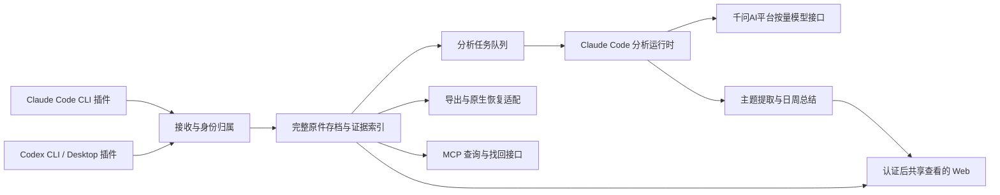

# Skynet 首版需求基线

日期：2026-09-24。状态：需求范围及整体设计已由用户确认，已合成为 [PRD v1.0](./PRD.md)。实施与技术验证尚未开始。

本文保留已确认需求基线和访谈映射；首版实施与验收以 [PRD v1.0](./PRD.md) 及用户后续指示为准。[访谈历史](./discovery.md) 中的历史建议不覆盖当前决定。[研究报告](../research/2026-09-24-agent-activity-observability.md) 分开标记事实、推断和待实测事项。

## 1. 已确认的产品目标

构建内部自用的 MCP server + Web 平台，自动采集员工使用 Coding Agent 的实际工作会话。通过每日、每周视图了解工作方向、进展、过程和会话内成果，并为管理者自行评价绩效提供依据；同时保存完整会话，支持导出与原生续聊恢复。

| 范围 | 用户已确定的选择 | 尚未确定或需验证的边界 |
| --- | --- | --- |
| 使用目的 | 进展/阻塞了解、成果及过程核查、绩效参考 | 报告按员工→项目→工作主题展开，含目标、关键活动、结果、阻塞、证据和活动统计 |
| 绩效形式 | 总结、过程和指标供人评价 | 首版不做 AI 评分/排名；未要求精确人工工时 |
| 采集客户端 | Claude Code CLI、Codex CLI、Codex Desktop | OS、版本、人数、WSL/SSH/容器与多设备情况 |
| 接入 | 注重安装易用性，优先希望 npm 安装后仅配一个授权环境变量；也接受各 Agent 插件市场 | 具体初始化、宿主信任、后台生命周期、升级卸载与所需依赖见安装设计，尚需实测 |
| 采集范围 | 所有项目；接入后新会话自动同步；接入后继续使用的旧会话同步完整记录 | 不批量扫描/导入其余旧会话；未完成/截断/不支持的数据须显示缺口 |
| 内容 | 完整工作对话、命令、工具结果、代码变更等会话材料 | 来源不可见内容不能凭空补全；原生关联附件/子会话的完整性需验证 |
| 存储 | Linux 服务器；原件默认不自动删除，展示存储占用 | 实际容量、网络环境、服务器自身备份部署信息待登记 |
| 找回 | 完整可读导出 + 回到原 Agent 继续对话 | 各客户端/版本实际恢复能力；未选择代码文件、依赖和运行进程恢复 |
| 认证与归属 | 每人独立账号/接入凭据，插件一次绑定，支持多设备；认证后可以查看全部数据 | 开放查看不等于任意覆写来源身份或原始内容 |
| 外部成果关联 | 首版不做 | 不主动接 Git/PR/issue 等成果系统；可使用会话里已有的工具结果和文件变化 |
| 分析 | Claude Code 执行提取、分析、总结；千问AI平台按量 Anthropic 兼容接入 | 凭据、具体模型和用量配置待部署，结构化输出和长会话分析需验证 |
| 更新节奏 | 在线原文以一分钟内可见为目标，分析异步更新 | 目标待实际规模压测；故障和缺口必须可见 |
| 日周汇总 | Asia/Shanghai 每日 09:00 汇总前一日，周一 09:00 汇总上周 | 迟到数据到达后可重新汇总并记录版本 |
| 人工纠错 | 支持补充说明、更正归类和重新汇总 | 保留原文与更正历史 |
| 使用形态 | 内部自用 | 不引入对外多租户商业化设计 |

## 2. 已记录的决策

- [ADR-0001：完整会话材料存档](../adr/0001-preserve-full-session-records.md)。所有项目均覆盖，支持导出和原生续聊目标。
- [ADR-0002：所有项目采集与认证后共享查看](../adr/0002-collect-all-projects-with-shared-authenticated-read.md)。首版不做按员工/团队读取隔离。
- [ADR-0003：Claude Code 执行服务端分析](../adr/0003-use-claude-code-for-server-analysis.md)。采用用户提供官方文档中的按量接入路线。

## 3. 已确认的模型接入方向

用户初始使用 `QwenTokenPlanCn` 称呼所需接入，第三轮接受保留 Claude Code、选择支持后台运行的模型接入建议，并提供[千问AI平台 Claude Code 官方文档](https://platform.qianwenai.com/docs/developer-guides/clients-and-developer-tools/claude-code)。当前以该文档的按量接入路线为实施依据，不将客户端配置别名当作模型 ID。

该文档区分 Token Plan 与按量计费。后台分析使用按量 Anthropic 兼容入口 `https://maas.qianwenaiapi.com/apps/anthropic`，配置匹配的千问AI平台 API Key 与模型；不混用 Token Plan 专属凭据或接口。[同一官方文档的按量配置](https://platform.qianwenai.com/docs/developer-guides/clients-and-developer-tools/claude-code#配置按量计费)

模型 ID、凭据及用量预算属于部署配置，本轮未运行付费接口。此前套餐范围的研究作为选择背景保留，不重复询问已接受的接入方向。

## 4. 产品流程与实施约定

下列流程体现已经接受的产品建议；技术实现与兼容性仍需验证。服务器容量、安装命令和内部数据结构不在本轮伪装成已测试成果。

### 员工接入与归档

通过 npm 或对应 Agent 的插件市场完成一次接入、身份绑定和必要信任设置后正常工作。员工只需提供一个个人授权值，不要求手改多份配置。具体安装步骤属于[安装设计建议](../architecture/installation-design.md)，并未将 npm 安装脚本或宿主静默信任当作既有能力。

采集无需日常填报、特殊提示词或手动调用上报工具；本地缓冲处理断网，服务端显示实际已收到的数据范围。

全部项目都采集；项目识别只服务于归类，不作为过滤条件。多台设备、两个 CLI 与桌面上的同一员工归属需稳定，不能只靠本地用户名或模型自己填写的员工名字。

首次安装不扫描批量导入旧会话；接入后新会话正常采集，被继续使用的旧会话同步完整记录。恢复网络后的积压补传属于接入后的正常同步，不是历史导入。

### 管理 Web

| 页面 | 主要内容 |
| --- | --- |
| 总览 | 员工近期方向、进展、阻塞及采集/分析状态，链接到日/周详情 |
| 员工日/周视图 | 按项目与工作主题展开，呈现目标、过程、当前结果、问题、证据引用及活动规模 |
| 项目视图 | 聚合同一项目的人员与会话，不影响全部项目采集 |
| 会话详情 | 原始时间线、对话与工具记录、关联子会话、分析结果、已知缺口 |
| 存档找回 | 可读导出、原始恢复包、来源与版本说明、原生恢复验证状态 |
| 接入与处理状态 | 设备/客户端接入、同步积压、缺失内容、分析队列与失败重试 |

分析事实尽量链接到来源；Agent 的完成自述与实际工具返回分开表达。没有外部成果关联时，报告只对会话中有依据的行为和结果作判断，不能自动声称某 PR 已合并或已上线。

### 服务端分析

实施约定：原生会话原件、标准化事件和分析结果分开保存。原件支持找回，事件支持检索与统计，分析结果支持日/周阅读；任何一层都不能冒充另一层。

实施约定：分析任务读取独立材料副本，通过受限工具输出结构化结果，再校验来源引用。员工会话中的命令和指令作为分析材料，不能被分析 Agent 直接当作当前任务执行。服务端自己的分析运行属于平台任务，不回流为员工会话，不计入员工工作量。

分析失败或模型额度用尽时，采集和备份仍继续；分析等待/失败状态可见。报告的版本、输入范围、来源位置与模型配置应可追溯，避免原件变更后仍显示旧结论为最新。

### 找回

已确认两种能力：可读导出与原生续聊。恢复包应保留必要原件及来源信息；完整恢复需要在隔离的测试环境中从服务端备份独立完成验证，而不是仅调用原机器已有会话的 resume。

Claude CLI 官方有从绝对 transcript 路径恢复的入口；Codex CLI/Desktop 任意备份重建、索引与附件依赖尚待验证。[Claude sessions](https://code.claude.com/docs/en/sessions)、[研究中的恢复边界](../research/2026-09-24-agent-activity-observability.md#93-claude有原生-transcript-入口但恢复仍有明确边界)

备份成功、原件完整和原生恢复成功需要分别记录。下载其他员工的会话继续使用时，也不能重写原员工的活动归属；复制/恢复后的新活动如何关联由恢复实现处理并测试。

## 5. 第三轮决定与部署待登记项

用户已接受 Q13—Q19 的全部建议，随后修订 Q16，且已确认继续使用旧会话时同步完整记录。以下为当前决定，不再保留为待答问题。

| 编号 | 主题 | 当前决定 |
| --- | --- | --- |
| Q13 模型接入 | Claude Code + 千问 | 采用用户所给文档的按量接口，保留 Coding Agent 分析运行时 |
| Q14 环境与规模 | 客户端按实际环境覆盖，Linux 服务端 | 推荐方向已接受；实际员工 OS、人数、WSL/SSH/容器、现有服务器规格尚未提供，不编造 |
| Q15 认证与归属 | 独立账号与多设备 | 每人独立账号/接入凭据，一次绑定；认证后仍可查看全部 |
| Q16 历史与保留 | 不批量导入历史，原件不自动删除 | 被继续使用的旧会话同步完整记录；其余旧会话不扫描，接入后断网积压正常补传 |
| Q17 更新时间 | 近实时原文，异步分析，定时汇总 | 在线原文一分钟目标；Asia/Shanghai 每日09:00汇总前日、周一09:00汇总上周 |
| Q18 报告内容 | 员工→项目→工作主题 | 跨会话归组；目标、活动、结果、阻塞、证据、活动统计 |
| Q19 分析纠错 | 更正并重算 | 支持补充说明、更正归类、重新汇总；原文和修改历史保留 |

### 实施时需要登记和验证的事项

- 登记试点客户端 OS/build、人数/设备数、远程执行环境、服务器容量和网络；这些是未提供的环境事实，不是已知值。
- 设置模型凭据、具体模型、并发与用量预算，用样本实测后估算报告成本和异步处理能力。
- 测量在线同步、断网补传、异常退出时的最后成功备份位置；一分钟原文可见目标不等于强杀或断网时零丢失。
- 部署服务器自身备份与恢复流程，记录实际可恢复点和耗时；仅有员工端到服务器同步不等于服务器已有灾备。
- 实施账号创建/停用、插件凭据、身份关联；查看共享与证据不可任意覆写同时成立。
- 为工作主题归组和完成程度标签建立带证据的验收样本，更正采用追加历史而非覆盖原件。
- 三种入口的插件事件覆盖、原件获取与原生恢复由受控实验查明；尚未通过的兼容性不能列为已支持。
- 已补充[可行性与整体架构](../architecture/solution-design.md)和[技术验证计划](../architecture/validation-plan.md)；技术建议尚未等同实测结论，未启动真实员工数据采集。

## 6. 后续验证的关键样例

1. 两种 CLI 与 Codex Desktop 的相同活动被采到，来源缺口有明确记录。
2. 一名员工多设备并行、跨项目、子代理和恢复会话不重复计量、不误归他人。
3. 断网、强杀、休眠和插件升级不影响正常编码；能补传的补传，无法恢复的缺口可见。
4. 先收妥服务端备份，再隔离原本地历史，只使用导出的恢复材料完成续聊。
5. 未登录无法查看；任一正常登录用户均可看全部；上传归属不能通过任意填写员工名字冒充。
6. Agent 自述“测试通过”但无执行结果时，报告表达证据程度；失败实验与排查过程仍被保留。
7. 分析任务产生的 Claude Code 会话不进入员工数据，不触发无限递归分析。
8. 模型服务不可用时，原始备份继续；长会话分段汇总后的事实能追溯到原文。
9. 安装后未继续的旧会话不上传；继续一条旧会话时完整同步该条，而不是整批扫描其他旧会话。
10. 日/周汇总按北京时间触发；迟到记录和人工更正触发重算，保留原文与历史版本。

未运行这些验证，也未声称当前客户端恢复兼容性已经通过。
