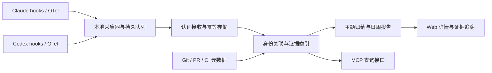

# Claude Code / Codex 工作活动采集：首轮一手资料研究

研究日期：2026-09-24。状态：需求访谈输入，**不是已接受的产品或架构决策**。

范围：员工已完全同意；一次安装后不要求员工每天填报；至少支持 Claude Code 与 OpenAI Codex；管理者通过 Web 查看每天、每周工作方向及证据。本轮只读公开官方资料，没有读取本机或员工的会话、凭据、提示词，也没有安装采集程序。

标记：**事实**来自链接指向的官方资料；**推断/建议**是本研究的产品分析；**待验证**表示官方文档未建立保证，或需要指定版本、端和登录方式实测。资料随产品更新，不能视为永久兼容性承诺。

## 1. 对需求有直接影响的结论

1. **事实：普通 MCP server 不能被动旁观宿主的全部活动。** MCP 隔离各 server，完整对话留在 host；server 只得到 host 发给它的上下文。这既不是全局日志订阅，也不是内置 shell、编辑器和其他 MCP server 的自动镜像。[MCP 架构规范 2026-07-28](https://modelcontextprotocol.io/specification/2026-07-28/architecture)
2. **事实：Claude Code 和当前 Codex 均有 lifecycle hooks。** Codex 已不止 `notify`；官方明确允许把聊天送到分析系统。具体事件、版本及缺口见后文。[Claude hooks](https://code.claude.com/docs/en/hooks)、[Codex hooks](https://learn.chatgpt.com/docs/hooks)
3. **推断：可行产品应包含采集适配层，MCP 是其中一种接入/查询接口。** “安装一个普通 MCP，就全量知道员工做了什么”不成立；“安装含 hook 的插件/采集器，自动汇总证据”具备文档依据。
4. **推断：应分别展示活动、成果、覆盖质量。** agent 运行、提示词、改动与测试能证明某些行为发生；不能单独证明员工全部工作、有效工时或业务价值。SPACE 研究同样反对用单一活动指标代表开发者生产力。[SPACE 原始研究](https://www.microsoft.com/en-us/research/publication/the-space-of-developer-productivity-theres-more-to-it-than-you-think/)
5. **待验证：低干扰不等于零开销，也不等于永不丢数据。** 需要对 hook 延迟、异常退出、离线补传、升级和跨端复用进行验收。

## 2. Claude Code：官方可采集接口

### 2.1 Hooks 与 transcript

**事实摘要：** 官方称终端、IDE、Desktop、cloud 运行相同 hook 事件，但脚本仍须存在于实际执行环境。关键事件包括会话起止、用户提交、工具前后/失败、子代理起止、Stop 和压缩。输入用 JSON，含 `session_id`、`cwd`、`transcript_path`；适用事件另有 `prompt_id`、`agent_id`、`tool_use_id`、工具输入/响应。命令从 stdin 接收；stdout/退出码能影响运行，所以观测 hook 必须避免产生控制指令。默认等待 hook，`command` 可异步；`-p` 结束会取消未完成异步 hook。transcript 异步写入，当前末条消息可能尚未落盘；Stop 的 `last_assistant_message` 更合适。`prompt_id` 至少需 v2.1.196。[Claude hooks reference](https://code.claude.com/docs/en/hooks)

**推断/建议：** hooks 负责捕捉原始事件和关联键；不要每个事件全量读取整份 transcript。需要历史补齐时增量处理，保留解析器版本与失败记录；不能把 transcript 当永久稳定 API。

### 2.2 OpenTelemetry

**事实摘要：** `session.id`、`prompt.id`、`tool_use_id` 可关联事件；`event.sequence` 按进程计数，resume 后可重复。transcript 格式内部可变。普通 `user.id` 是安装随机标识；Claude 账号可带账号/email，API key/第三方 provider 需另附人员身份。仓库属性需开启且至少 v2.1.269；响应事件至少 v2.1.193。`active_time` 包含 user/cli 活动，并非人工工时。[Claude monitoring](https://code.claude.com/docs/en/monitoring-usage)

**事实：采到元数据，不代表同时采到正文。** 以下是关键开关摘要，详尽字段与版本以同一官方页面为准。

| 数据层 | 默认与启用条件 |
| --- | --- |
| 用量/事件元数据 | 需 `CLAUDE_CODE_ENABLE_TELEMETRY=1`，并配置 metrics/logs exporter；工具结果包含状态、耗时、大小等。 |
| 用户提示正文 | 默认脱敏；`OTEL_LOG_USER_PROMPTS=1` 开启。 |
| 助手回答正文 | `OTEL_LOG_ASSISTANT_RESPONSES` 控制；未设时跟随 prompt 开关，内容有截断。 |
| 工具参数/输入 | `OTEL_LOG_TOOL_DETAILS=1` 开启，默认关闭，存在截断和部分桌面内置工具名称例外。 |
| 工具输出内容 | `OTEL_LOG_TOOL_CONTENT=1` 控制 `tool.output` span event；需另开启 beta tracing，默认关闭且有截断。不能把普通 tool_result 日志当完整输出。 |

来源：[Claude monitoring 配置与 traces](https://code.claude.com/docs/en/monitoring-usage)。

**推断/建议：**

- OTel 适合结构化统计、成本和交叉核验；hooks 适合补齐业务语义、细粒度关联和本地落盘。
- 开启“提示词正文”会显著改善方向识别；只采次数、token 与工具名称无法可靠区分“在做哪个业务需求”。需要由用户决定采集内容范围。
- 若用 OTel 与 hooks 双采，同一工具调用必须合并成一项活动，不能算两次。
- 依赖某字段前先做 capability detection；不能让新字段缺失变成“员工没有工作”。

## 3. Codex：不能沿用 notify-only 的旧认知

### 3.1 Hooks、MCP hook 与边界

**事实摘要：** 当前支持 `command`、`mcp_tool`，有会话、用户提交、工具前后、权限、压缩、子代理、Stop、Interrupt。输入含 `session_id`、`cwd`、model、可空 `transcript_path`；turn/tool/agent 有各自 ID。子代理 hook 的 session 是父 session。shell、apply_patch、MCP 和多数 local function 可观测；hosted WebSearch 等不经过此路径。transcript 格式不稳定。command 可异步，但结束时未完成任务取消；SessionEnd 同步。MCP hook 同步、依赖既有连接，启动未就绪可跳过，且不支持 SessionEnd。非 managed hook 需信任；异步输出不能阻止原操作。[Codex hooks](https://learn.chatgpt.com/docs/hooks)

**事实：** hooks 可随 plugin 分发，但安装/启用不自动信任 hooks；在 web 安装插件也不会自动把脚本部署到执行环境。企业可自行部署脚本。[OpenAI 插件打包](https://developers.openai.com/plugins/build/plugins)

**推断/建议：** 为满足低干扰与离线能力，优先验证“短命令 hook → 本地持久队列 → 后台发送”。“hook 直接同步调用远程 MCP”可做样机对照，不能默认达到全部采集与无感要求。此处是候选方案，不是用户已选架构。

### 3.2 OTel、notify、本地会话文件

| 机制 | 官方建立的事实 | 对本需求的含义（推断） |
| --- | --- | --- |
| OTel | 默认不导出；可发聊天/API/stream、用户提示、工具批准与结果事件，含耗时、状态、部分 token；prompt 默认脱敏，工具结果是 snippet；批处理并在关闭时 flush，只导出 OTel 模块产生的内容。[安全与 telemetry](https://learn.chatgpt.com/docs/agent-approvals-security) | 可作为独立统计与核验通道；不能等同完整会话或不丢失的审计日志。 |
| `notify` | 当前仅 `agent-turn-complete`，参数含 thread/turn、cwd、输入消息、末条回答。[Advanced configuration](https://learn.chatgpt.com/docs/config-file/config-advanced) | 可兼容旧安装或粗粒度完成摘要；不能重建中途工具活动、失败与全部终止状态。 |
| 本地文件 | `CODEX_HOME` 保存配置、history、日志等；历史可关闭/限大小。hook 提供的 transcript 路径可空且格式不稳定。[Advanced configuration](https://learn.chatgpt.com/docs/config-file/config-advanced)、[Hooks](https://learn.chatgpt.com/docs/hooks) | 不依赖猜测目录全盘扫描；不能把 `history.jsonl` 当完整工具日志的保证。对特定版本验证读取位置、存留与 JSON schema。 |
| 配置作用域 | 项目 `.codex/config.toml` 的 `otel`、`notify` 被忽略，应放用户配置；hook 是单独配置能力。[Configuration reference](https://learn.chatgpt.com/docs/config-file/config-reference) | 不能只提交仓库配置就宣称完成全员 telemetry 安装。 |

### 3.3 CLI、IDE、桌面、cloud：明确区分

**事实：** 当前官方文档把桌面形态写为 ChatGPT desktop app 中的 Codex；CLI 和 IDE 共享配置层，app 中 Codex agents 继承同类配置；ChatGPT web 的 Work managed 环境不读取本机 Codex 配置。[Developer settings](https://learn.chatgpt.com/docs/developer-settings)、[Desktop app](https://learn.chatgpt.com/docs/app)

| 范围 | 已建立的支持依据 | 尚不能承诺 |
| --- | --- | --- |
| Codex CLI 交互模式 | hooks、OTel、notify 的配置与 CLI 检查入口已文档化 | 当前员工旧版本是否实现全部事件；异常退出的投递可靠性 |
| Codex VS Code 扩展及兼容编辑器 | 共享配置；app-server 文档明确以 VS Code 为 rich client 示例 | 每版扩展是否同版本 runtime；远程 SSH/WSL 内脚本和数据实际位置 |
| Codex 桌面本地工作 | 共享 agent 配置与 plugin runtime 有官方依据 | 不同 OS/build 的 trust UI、事件字段和 OTel 完整等价性 |
| Xcode/JetBrains 的 Codex 集成 | 官方 IDE 页把它们列为各 IDE 自有集成 | 不应推断等同 VS Code；本轮未找到全量采集兼容保证。[IDE 文档](https://learn.chatgpt.com/docs/codex/ide) |
| Codex cloud / web Work | 运行环境与本地不同；local config 不会自然生效 | “在笔记本安装一次”不自动覆盖云端运行；需单独部署/接口与权限验证 |

**待验证：** 本轮官方 hooks 文档没有提供可覆盖全部端的最低版本矩阵；不要虚构“Codex ≥ 某版本全部支持”。首轮试点应登记准确 product/build、runtime、OS、执行位置、登录模式，并导出实际支持事件矩阵。

**事实：** 本地桌面、CLI、IDE 支持 ChatGPT 登录和 API key；cloud 要求 ChatGPT。两种登录分别受 ChatGPT workspace 和 API organization 政策约束；API key 模式有部分依赖 workspace/cloud 的能力限制。[Authentication](https://learn.chatgpt.com/docs/auth)

**待验证：** 官方未据此保证任意 API key 运行都能进入同一企业 analytics；跨账号、多人共享 key、个人订阅与企业身份映射必须另做产品身份绑定。

### 3.4 App-server 与 `exec --json`

**事实：** app-server 是嵌入 Codex rich client 的接口，包含 thread/turn/item 流、存量 thread 读取和 token 更新；部分方法/字段要 `experimentalApi`。官方同时把 app-server 命令/WebSocket transport 标为 experimental、非生产支持；不能因为某些 API 有稳定面就忽略这一边界。[App Server](https://learn.chatgpt.com/docs/app-server)

**推断：** 控制客户端时更容易实现完整关联；额外启动一个 app-server，不等于自动订阅同机其他客户端所有活动。能否只读访问目标端持久线程、存量线程的覆盖、已有进程多订阅及其副作用，都需独立实验。

**事实：** `codex exec --json` 输出 JSONL 事件，含 thread/turn/item、命令、文件变更、MCP、web search 和 usage；默认复用 CLI 登录。[Non-interactive mode](https://learn.chatgpt.com/docs/non-interactive-mode)

**推断：** 适合自有自动化/CI 任务的采集；将员工日常交互都改成该调用方式会改变工作流，不能作为“原客户端一次安装无日常负担”的默认替代。

## 4. 已有官方面板能解决什么

**事实：** Claude Teams/Enterprise 面板可看采用、会话、接受代码以及 GitHub contribution；贡献指标为 public beta，范围不含 Console API/第三方集成；Console 有另一个用量/花费面板。[Claude analytics](https://code.claude.com/docs/en/analytics)

**事实：** OpenAI 官方区分交互 dashboard、聚合 Analytics API、审计 Compliance API；Daily Usage Analytics 是 workspace 范围聚合，是否启用、权限与 schema 需检查官方契约，不能当 raw audit log。[Workspace analytics](https://learn.chatgpt.com/docs/enterprise/workspace-analytics)、[Analytics API](https://learn.chatgpt.com/docs/enterprise/analytics-api)

**推断：** 若用户只需要采用率、用量、支出，可以先用已有面板。自建平台的潜在价值是 Claude/Codex 统一人员视图、跨会话工作主题、事件到产物证据链、每日/每周叙述和采集健康状态。先验证现有面板不能满足哪几个管理决策，再决定自建深度。

**研究限制：** 本轮没有登录企业后台；OpenAI 该文档把完整 API 契约交给登录后的 API reference，因此没有臆造端点、字段、SLA、套餐门槛或原始会话可取范围。

## 5. 建议证据模型与不可直接合并的概念

本节全部是**设计推断**，有待访谈取舍。

| 层级 | 建议记录 | 不能直接等同 |
| --- | --- | --- |
| 人与设备 | 平台 employee_id、受控 device_id、collector installation_id、实际登录主体及映射来源 | 本地用户名、随机 user.id、Git author 都不必然是同一人 |
| 执行 | product、版本、surface、local/remote/cloud、process/run_id | 同一 session 不代表同一次进程生命期 |
| 会话关系 | provider session/thread、turn/prompt、agent/parent、fork/resume 链 | 子代理 token/时间不能既算子项又算父项增量 |
| 活动 | 工具开始/结束、结果、错误、读取/编辑/测试/研究、源时间和接收时间 | 调用次数不是工作量价值；成功执行测试命令不自动等于测试全部通过 |
| 产物 | 仓库 ID、worktree、branch、commit SHA、PR、文件/测试结果的证据引用 | cwd 不等于仓库；改文件不等于提交；提交不等于合并/上线 |
| 工作主题 | 从多轮提示与行为归纳的主题、关联 issue/任务、置信程度、原始证据引用 | 同一会话可多主题；同一主题可跨人、仓库、agent 和日期 |
| 报告 | 事实句、推断句、证据链接、生成版本、覆盖窗口、修订 | 摘要不是原始证据；模型的“已完成”自述不能独立证明完成 |

建议最小证据链：**员工身份 → 执行会话 → 具体活动 → 产物/检查结果 → 日周总结**。若某一跳缺失，应显示“未关联/未核验”，不自动补齐。

### 时间与工作量口径

- 会话跨度：首次到末次活动的时钟范围。
- agent 运行区间：模型/工具执行或已定义 turn 的区间；多个并发区间可同时出现。
- 观测活动时段：依据明确阈值推导的活动窗口，必须展示算法和误差边界。
- 人工投入：本轮采集接口没有建立可准确测量员工全部人工工时的保证。
- token、调用数、LOC、测试次数：分别表示资源或行为规模；返工、重复尝试与机器自动执行会增加数值而不一定增加产出。

设计例：一个员工并发运行三个各 30 分钟的 agent，可报告“agent 累计运行 90 分钟；覆盖时钟区间 30 分钟”，不能直接显示“员工工作 1.5 小时”。

### 离线、重复、缺口

建议采集 envelope 带稳定 event_id、来源/版本、设备与进程 ID、source timestamp、received timestamp、事件顺序和 payload schema。使用本地持久队列、带确认的批量发送、幂等接收、指数退避；在请求重新投递时复用 event_id。

对多源重复，区分“同一投递重试”与“hook/OTel 对同一工具调用的两个观察”。优先 provider 的 tool/turn ID 做关联，保留两个来源；无法可靠关联时标记而非时间相近即强行合并。

应单独显示：离线等待、暂未覆盖端、hook 未信任、collector 停止、正文未启用、解析不兼容、落盘截断、缺结束事件、时钟异常。零事件可能意味着未工作，也可能意味着未采到；这两个解释必须能区分。

## 6. 候选架构与取舍

以下为候选，无一已被用户选择。

| 方案 | 能力与成本 | 适用条件 |
| --- | --- | --- |
| A. 只用官方 Analytics/OTel + Web | 部署较轻、用量数据结构化；跨厂商方向与产物证据较弱 | 首要需求为采用率/资源消耗与总体趋势 |
| B. 各 agent hook + 本地 collector + 接收服务 + Web，MCP 提供查询/补充工具 | 原工作流可保留；能做本地过滤、持久队列、增量补齐；需要 OS/版本适配与运维 | 首要需求为“做了什么，以及有哪些可追溯证据” |
| C. Hook 直接调用远程 MCP/HTTP | 部件少、原型快；网络与 agent 生命周期耦合，断网/启动/退出边界明显 | 接受部分事件和延迟、验证用样机 |
| D. 自有 host / app-server / SDK wrapper | 对执行与事件控制更强；改变员工入口、维护范围更大 | 公司愿意统一 agent 入口与执行环境 |

B 的待验证数据流：

“本地 collector”是组件职责，不预先决定常驻 daemon、按事件启动的小程序或平台服务。可靠性与开销实验后再选。

## 7. 最小验证实验

本轮没有运行以下实验。建议先做人工可核对的合成工作集，不用真实员工历史做首个样本。

| 实验 | 操作 | 需要得到的结论 |
| --- | --- | --- |
| 端与版本矩阵 | 指定 Claude/Codex CLI、实际 IDE、实际桌面版本，各跑同一脚本化任务 | 哪些事件/字段真的有；版本最低要求；安装位置与身份 |
| 基本活动 | 一个用户提示；读文件、编辑、通过/失败测试、MCP、hosted 搜索、取消与错误 | 不同工具路径的覆盖、开始结束关联、正文与截断 |
| 多会话/代理 | 并发两个会话、一个子代理、resume、fork、压缩 | 无误合并、无双重计数；父子关系与顺序正确 |
| 生命周期 | 正常退出、强杀、电脑休眠/重启、collector 重启 | 哪类尾部事件丢失；队列可否恢复；缺口是否可见 |
| 离线与幂等 | 断网后继续工作；恢复网络；同批次重发 | 数据自动补传；界面统计不翻倍；积压有状态 |
| 安装与升级 | 已有 hooks/config 的机器安装、升级、卸载 | 原配置不丢；必要信任可解释；不要求每天手动操作 |
| 身份与范围 | 两设备同一员工、API key/订阅、个人与工作 repo | 人员准确关联；批准范围外不采集；空字段处理正确 |
| 性能 | 启用前后相同任务对照、远端不可达、事件高峰 | hook 增量延迟、CPU/内存/IO、队列上限；阈值由用户确认 |
| 证据与摘要 | 预先标注的数个任务含返工和无代码研究，自动生成日报 | 每条事实可点回证据；推断可识别；不把重试当成果 |
| 产物关联 | 两个 worktree、分支切换、提交、PR 合并、外部人工改动 | 关联何时可确定；何时仅相关；不冒认其他人的更改 |

验收应至少报告“支持事件中的捕获率、重复率、身份归属错误、完整证据引用率、最长补传延迟、hook 增量延迟”。百分比/SLO 尚未选择；不要先虚构“100% 全量、零开销”。

## 8. 下一轮需求访谈应锁定的分歧

1. 管理者首要要判断的是工作方向、实际交付、投入规模、成本、阻塞，还是绩效评价？哪个排第一？
2. “工作量证明”的最低合格样本是什么：带来源的工作过程，还是必须有 commit/PR/测试等外部产物？研究、设计、排错如何算？
3. 首发的实际客户端、OS、远程环境和登录方式是什么？支持“Claude/Codex”仍不足以形成可验收范围。
4. 日报是否需要即时刷新；员工是否允许纠正主题和身份误关联；管理者能看到多深的原文？
5. 工作内容允许采到哪一级：元数据、提示/最终答复、工具命令、文件 diff、完整工具输出？本地脱敏与服务端保留如何取舍？
6. “无感”是否允许首次登录/信任、常驻后台、故障提醒；允许多大的性能开销和离线补传时延？
7. 自建平台的首个价值是否能用 5–10 名员工、两个 agent、一个团队、明确仓库范围验证？

上述问题的答案应进入需求文档；只有经用户确认的选择才应成为 Accepted ADR。

## 9. 首轮访谈后的定向补充：插件安装与会话备份恢复

补充日期：2026-09-24。用户已说明：平台自用；同时服务进展了解、成果核查和绩效参考；希望保存全量会话，并在本地丢失后从服务器导回；询问能否用 Agent plugins 安装采集。尚未明确具体客户端、OS、执行位置，以及“导回”是否必须原生继续对话。本节仍不作已接受架构决策。

### 9.1 插件可以承担安装与自动采集，但不自动提供备份产品能力

**结论（推断）：可以用 Agent plugin 作为员工安装入口。** 插件可把 hooks、采集脚本和 MCP 一起交付，日常采集由 hooks/运行时触发；不需要员工每次手动调用 skill。服务器存储、断网补传、全量归档、恢复校验仍是我们需要实现的产品能力。

**Claude Code 官方事实：** 插件可包含 hooks、脚本、MCP；启用后 bundled MCP 自动启动。`${CLAUDE_PLUGIN_DATA}` 是跨会话/版本的数据目录，但从最后一个 scope 卸载时默认删除，可用 `--keep-data` 保留。复制到 cache 的插件可自动安装带受支持 lockfile 的 npm/Bun 依赖，但需包管理器已在 PATH，跳过 lifecycle scripts；Python、原生构建等需另外处理。版本变更控制更新，运行中的 hooks/MCP 可能继续使用旧路径，需 reload 或新会话。[Claude 插件参考](https://code.claude.com/docs/en/plugins-reference)

**Codex 官方事实：** portable Agent Plugins 可用 root `plugin.json`、`mcp.json`，OpenAI hook 设置在扩展区；旧 `.codex-plugin` 布局仍兼容。提供 `PLUGIN_ROOT`/`PLUGIN_DATA` 及 Claude 兼容环境变量。安装不自动信任 hook；脚本须部署在实际执行环境，web 安装不完成脚本部署。[OpenAI 插件打包](https://developers.openai.com/plugins/build/plugins)

**推断/建议：**

- 可以共用采集核心和服务端协议，为 Claude/Codex 提供各自的 manifest、事件适配和安装检查。存在 portable 格式不代表所有宿主对组件和事件完全等价。
- 插件安装完成后应进行一次“身份绑定—依赖检查—hook 信任/启用—测试事件到达”的自检。员工不需要日常填报，但首次配置可能有必要交互。
- 本地队列不能存在会被更新替换的 plugin root；即便使用 data 目录，也要设计卸载前队列处理、导出和服务端保留策略。
- 为自用团队，私有分发足以作为候选；无需先发布公开插件。实际分发方式与自动更新渠道仍待选择。
- 同步 MCP tool hook 的限制仍见第 3.1 节：它能自动接收宿主指定事件，不能天然覆盖任意运行事件，也不能替代离线队列。

**待验证：** Codex 文档虽说明 writable data 目录，本轮未找到与 Claude 完全等价的跨版本保留、卸载删除和依赖自动安装保证；不能照搬 Claude 行为。插件也不默认等于 OS 常驻服务，agent 退出后是否继续补传需实测/另实现。

### 9.2 “导回”必须区分四个验收目标

| 目标 | 用户实际得到的结果 | 本轮判断 |
| --- | --- | --- |
| 可读归档 | 从服务器下载/浏览对话，供人查阅或作为新会话参考 | 可由平台自行实现；不等于原生续聊 |
| 原始文件备份 | 下载与采集时字节一致的原生 transcript 及清单 | 可作为产品能力；须独立验证完整性、附件和子会话是否包含 |
| 原生续聊 | 原 coding agent 识别恢复的数据、显示历史并接受下一轮 | Claude CLI 有明确原始 transcript 路径入口；其他端/版本逐一验收 |
| 代码和环境恢复 | 还原当时 worktree、未提交改动、依赖、终端/进程状态等 | 会话备份不自动提供；必须另外定义范围 |

四层的差异是**产品分析**。服务器“有完整可读文本”不能直接宣称“原生完整恢复”。

### 9.3 Claude：有原生 transcript 入口，但恢复仍有明确边界

**事实：** CLI 官方支持 `claude --resume <transcript-path>`，参数为 `.jsonl` 的绝对路径；也明确可用 SessionEnd hook 归档 transcript。`/export` 是给人阅读的 rendered transcript。恢复会话保留工具调用与结果，但崩溃时尚未完成的工具不会重跑或完成；部分启动配置需重新传入。transcript 内部格式可变；Desktop、web、VS Code 各自维护会话历史，这份 sessions 文档主要覆盖 CLI。[Claude sessions](https://code.claude.com/docs/en/sessions)

**推断：** “服务器下载未经改写的 Claude CLI transcript → 指定路径 resume”是有官方入口支持的可行恢复路线。仍应在空白配置目录/新机器上验证，而不能只测试本机已有 session 的 ID 恢复。跨版本、附件、子代理历史、fork/compact 状态、路径变化与重复 session ID 都需验收。

**事实：** 原生 transcript 与子代理目录包含会话数据，checkpoint 文件另存在 `file-history`；history.jsonl 用于提示历史，不是完整会话替代。[Claude 目录说明](https://code.claude.com/docs/en/claude-directory) `/rewind` 不覆盖 Bash 命令造成的文件改动。[Claude checkpointing](https://code.claude.com/docs/en/checkpointing)

**事实：** Claude cloud 的 `--teleport` 是另一条专门路径：拉取云会话及分支并在本地载入历史，要求同账号、同仓库、远端分支可用及干净工作区；API key 不可用。它不是从本产品任意备份导入的通用接口。[Claude cloud/teleport](https://code.claude.com/docs/en/claude-code-on-the-web)

### 9.4 Codex：已确认存量续聊与迁移；尚无任意备份恢复保证

**事实：** `codex resume` 按已保存 session ID/名称继续；`unarchive` 恢复仍存在的归档会话。两者不是“重建已经删除的数据”。[Codex developer commands](https://learn.chatgpt.com/docs/developer-commands) 官方列出的 transcript 目录为 `$CODEX_HOME/sessions`，归档为 `$CODEX_HOME/archived_sessions`。[Codex troubleshooting](https://learn.chatgpt.com/docs/reference/troubleshooting)

**事实：** 桌面 macOS 的分享 snapshot 仅是受支持内容的只读快照，**不含原始工具调用、shell 命令、工具输入输出**；不能从该 snapshot fork 原线程，只能把它作为新线程附件。[Codex snapshot](https://learn.chatgpt.com/docs/use-chatgpt)

**事实：** `/import` 是从 Claude Code/Cursor 等迁移支持的设置和近期聊天；CLI 有数量/时间窗口及本地运行限制。这不构成从本产品 Codex 备份恢复的契约。[Import from another agent](https://learn.chatgpt.com/docs/import)

**待验证：** 本轮允许的官方文档没有建立“将任意服务器备份写回 sessions 即必定可原生续聊”的保证，也没有建立跨版本/跨端 restore API 契约。不能因为 JSONL 位于该目录，就承诺复制单文件足够；索引、metadata、关联子线程及资源依赖需要受控实验。app-server 的 `thread/read`/`thread/resume` 操作已有线程也不能单独证明这一点。

### 9.5 对采集设计与下一轮问题的影响

以下是**建议**，尚未成为承诺：

1. 若目标包括原生恢复，除了标准化活动事件，应保存原生文件的版本化副本及 manifest：来源产品/build、session 关系、原路径、文件大小/hash、时间与一致性标记；展示层脱敏副本和可恢复原件不能相互冒充。
2. 不依赖 Stop/SessionEnd 才做唯一备份。周期性或增量归档可减少崩溃损失，但采集中读取半条 JSONL、写入滞后、轮转和关联文件仍要处理。
3. Web 区分“截至何时已备份”“归档完整性已验证”“原生恢复已验证”。备份上传成功与恢复成功是两件事。
4. 试点增加灾难恢复实验：用合成会话归档，隔离原配置（不删除真实数据），仅从服务器下载恢复；分别在同版本/新版本、同路径/新路径验证。记录能否显示历史、能否继续一轮、附件/子线程缺失及代码状态。
5. 用户下一步需明确：是否必须原生续聊；是否也备份代码和附件；首发具体端；可接受的最大丢失窗口（RPO）与恢复时间（RTO）。这些问题决定“插件自动归档”是否足够，还是需要更完整的工作环境备份。

## 10. 服务端分析 Worker：Claude Code 与 QwenTokenPlanCn

补充日期：2026-09-24。本轮用户已确定首发 Claude Code CLI、Codex CLI、Codex desktop；同时需要可读导出与原生恢复；全项目、全会话采集；所有已认证平台用户可查看全部；服务端存储并允许外部模型分析；只供人类绩效参考、不生成评分；暂不做成果外部关联。用户提出服务端使用“ClaudeCode + QwenTokenPlanCn”进行提取、分析、总结。

### 10.1 先拆开执行程序、模型、套餐与配置名称

**待确认：** 本轮未在阿里云官方文档中找到精确名称 `QwenTokenPlanCn` 的定义，因此不能判定它就是某个具体套餐或模型 ID，也不能仅据名称推断个人版/团队版。它可能是用户现有客户端的 provider 配置别名；这只是推断，需用户确认对应产品名称、版本和配置来源，**不需要提供 API Key**。

**事实：** 官方把 Token Plan（个人版/团队版）、Coding Plan、百炼按量计费分为不同接入方案；Claude Code 可通过各自 Anthropic 兼容端点连接千问等模型，API Key、Base URL 和模型名称必须配套。[百炼 Claude Code 接入](https://help.aliyun.com/zh/model-studio/claude-code)

**事实：** Token Plan 与 Coding Plan 是独立订阅产品；Token Plan 的协议兼容说明解决“技术能否接入”，不能取代各具体套餐使用范围。[Token Plan 概述](https://help.aliyun.com/zh/model-studio/token-plan-overview)

**产品解释：** Claude Code 是分析执行程序；千问是底层模型来源；Token Plan 是额度/服务方案；`QwenTokenPlanCn` 若是客户端别名，只是配置标识。这四者不应在架构和运维文档中合并成一个未经验证的“分析引擎”。

### 10.2 中国站官方使用范围：个人、团队、Coding Plan 均需区别于按量 API

| 服务方案 | 中文官方已明确的事实 | 对后台日/周摘要的判断 |
| --- | --- | --- |
| Token Plan 个人版 | 限编程/智能体工具内交互式使用；不用于自动化脚本、应用后端或非交互批量调用；工具内交互式发起的扩展调用属正常范围。[个人版订阅前须知](https://help.aliyun.com/zh/model-studio/token-plan-personal-overview) | 不能因外层程序叫 Claude Code，就认为自动定时 worker 属于允许范围。 |
| Token Plan 团队版 | 同样限兼容工具内交互式使用，明确排除自动化脚本/应用后端；席位 Key 属于分配成员本人。[团队版订阅前须知](https://help.aliyun.com/zh/model-studio/token-plan-team-overview) | 团队版不是本轮自动化限制的现成豁免。 |
| Coding Plan | FAQ 同样排除自动化脚本、自定义应用后端和非交互批量调用，并将按量 API 列为应用开发场景。[Coding Plan FAQ](https://help.aliyun.com/zh/model-studio/coding-plan-faq) | 不能用旧 Coding Plan 名称绕开 Token Plan 的场景核实。 |
| 百炼按量 API | 官方提供 Anthropic Messages 兼容接口及程序化 SDK/curl 用例，Claude Code 接入也有按量方案。[Anthropic 兼容 Messages](https://help.aliyun.com/zh/model-studio/anthropic-api-messages)、[Claude Code 接入](https://help.aliyun.com/zh/model-studio/claude-code) | **候选路径：**保留 Claude Code worker，改用适用于应用调用的实际 API 方案；尚未替用户选择或购买。 |

上表事实来自已打开的**中国站中文页面**，并非由英文个人版规则外推团队版。判断列是对当前“服务器自动提取/总结”场景的分析。这里没有断言所有千问接口或所有 Claude Code 自动化都禁止。

**事实：** Token Plan 专属 Key/端点和其他计费通道不能混用；配错可能鉴权失败或走到按量通道。[团队版快速开始](https://help.aliyun.com/zh/model-studio/token-plan-team-quickstart)

**推断：** “配额很多”“支持 Claude Code”“兼容 Anthropic”“在服务器能跑通”均不能单独证明允许持续后台处理员工日志。若用户实际拥有不同合同/企业约定，应以该实际方案确认结果为准，不能从配置别名猜测。

### 10.3 Claude Code 本身支持非交互分析程序

**事实：** 官方支持 `claude -p` 脚本/CI 调用，`--output-format json` 或 `stream-json`，并可用 `--json-schema` 输出结构化结果。`--bare` 跳过 hooks、plugins、MCP、CLAUDE.md 等自动发现；否则 `-p` 也会加载工作目录与用户配置。bare 不读取订阅 OAuth/系统 keychain，需要显式 API/provider 凭据。[Claude Code programmatic mode](https://code.claude.com/docs/en/headless)

**事实：** `--allowedTools` 是免确认许可，不是工具可用范围；应使用 `--tools` 限制内置工具，`--tools ""` 可关闭内置工具，但不自动禁用 MCP。`--restricted`（至少 v2.1.248）减少命令执行工具、约束文件工具范围，并限制读取配置来源；`--bare` 本身仍有 Bash/读/写工具，不能称作只读沙箱。[Claude CLI reference](https://code.claude.com/docs/en/cli-reference)

**事实：** 百炼兼容接口存在模型、参数与接口覆盖差异，结构化输出的严格程度也依模型而异。[Anthropic 兼容 Messages](https://help.aliyun.com/zh/model-studio/anthropic-api-messages)

**待验证：** “Claude 支持 JSON Schema”和“千问兼容 Messages”不自动证明特定 Claude Code build + 具体千问模型 + 实际端点在 `--json-schema`、tool use、token usage、长上下文与重试上完全兼容。正式实现前需做小样本往返测试；不能只验证一句“你好”。本轮没有调用付费接口。

### 10.4 保留 Claude Code 的候选方案

以下均未成为已接受决策。

1. **Claude Code + 百炼按量 Anthropic 兼容 API。** 保留用户指定的 agent 执行程序与千问模型方向；先确认可用模型、地区/endpoint、预算，再验证结构化分析。
2. **Claude Code + 用户已有的其他允许程序化处理的 API/provider。** 对核心采集、备份、Web 模型保持一致，只替换分析配置；需要用户明确愿意采用的 provider。
3. **先完成采集/归档/恢复，后台分析 provider 保留待定。** 如果必须保留当前 Token Plan，应先取得适用于该后台用途的明确供应商确认，再决定自动分析；不伪装成交互操作。

### 10.5 分析 Worker 的隔离与自循环风险

本节全部为**设计推断**，不是供应商文档直接承诺。

- 分析任务读取服务器中指定的归档副本，输出严格 schema、证据引用、输入版本和分析版本；不得让摘要覆盖原始备份。
- 将员工原始会话视作待分析数据，其中的命令、角色指令和路径不是 worker 的执行授权。若只是分类/摘要，优先不给执行工具；需要文件检索时只开放只读快照目录。
- 使用独立 worker 身份、配置目录和工作目录；通过工具限制与 OS/容器权限共同控制，不把 bare 当隔离边界。
- 服务端 worker 也是 Claude Code session。如果同一套全局采集配置把分析 session 当员工活动再次入库，就可能形成“分析→新会话→再分析”的循环，并污染绩效参考。应明确标记 `origin=analysis_worker`，与员工数据来源分开，禁止自动回流触发；这不减少用户要求的员工全量会话范围。
- 每次生成应记录原始输入范围、截断/缺口、状态和证据引用；失败进入重试/人工查看，不让“JSON 有效”自动等于“总结正确”。

### 10.6 此处真正需要用户确认的信息

只需确认 `QwenTokenPlanCn` 对应的**实际服务方案与配置来源**（个人版、团队版、Coding Plan、按量 API 或其他企业约定），以及是否接受保留 Claude Code、调整底层计费/API 通道的候选方案。不需要粘贴任何密钥，也不应先替用户迁移。

## 11. 用户指定千问AI平台文档的定向复核

补充日期：2026-09-24。用户补充了千问AI平台 Claude Code 接入页，并回复“全部按建议”。本节以该页及其同域官方链接为当前依据；第 10 节的百炼资料保留为研究历史。**用户已接受保留 Claude Code、后台分析采用适用的按量 API 方向；第 10.6 节的方案选择问题已收敛，不再要求重复批准。** 本轮只核实文档，未读取密钥、配置 provider 或发起模型调用。

### 11.1 同一客户端接入三种方案，不代表同一使用范围

**事实：** 用户指定的 [Claude Code 接入页](https://platform.qianwenai.com/docs/developer-guides/clients-and-developer-tools/claude-code)分别列出以下配置：

| 方案 | Anthropic 兼容 Base URL | 凭据类型 |
| --- | --- | --- |
| Token Plan 个人版 | `https://token-plan.maas.qianwenaiapi.com/apps/anthropic` | 个人版专属 API Key |
| Token Plan 团队版 | `https://token-plan.maas.qianwenaiapi.com/apps/anthropic` | 团队版专属 API Key |
| 按量计费 | `https://maas.qianwenaiapi.com/apps/anthropic` | 千问AI平台 API Key，文档所列格式为 `sk-ws-...` |

**事实：** 新域的 Token Plan 概述将个人版与团队版定义为 Credits 订阅，团队版另提供席位管理；协议兼容性说明的是工具接入条件。[Token Plan 概述](https://platform.qianwenai.com/docs/token-plan/overview) 专属 Key/URL 的计费通道不可与通用通道混为一谈；个人版 FAQ 明确说明配置通用通道可能产生独立按量费用。[个人版 FAQ](https://platform.qianwenai.com/docs/token-plan/personal/token-plan-personal-faq)

### 11.2 新域已独立确认后台调用边界

以下结论来自**新域自身页面**，未将旧百炼规则直接外推：

- **个人版：**“订阅前须知”限定兼容工具中的交互式使用，排除自动化脚本、自定义应用后端、非交互批量调用；工具内由人交互发起的扩展调用与后台任务有区别。[个人版概述](https://platform.qianwenai.com/docs/token-plan/personal/token-plan-personal-overview)
- **团队版：**同样明确排除自动化脚本或应用后端，席位 Key 仅供对应成员本人使用。多席位与不使用对话训练模型的承诺，没有取消上述场景限制。[团队版概述](https://platform.qianwenai.com/docs/token-plan/team/token-plan-team-overview)
- **按量 API：**官方提供 Python、Node.js、curl 程序化调用方式；计费文档将按量 API 与 Token Plan 分开，并提供批量调用计费说明。[首次 API 调用](https://platform.qianwenai.com/docs/developer-guides/getting-started/first-api-call)、[API 计费说明](https://platform.qianwenai.com/docs/developer-guides/getting-started/pricing)

**研究判断：** 当前日/周摘要是自动后台任务，不能通过把调用程序命名为 Claude Code 而归入 Token Plan 交互用途。保留 Claude Code 执行程序、使用文档中的千问按量 Anthropic 通道，符合已接受的方向；这里不声称该通道不受任何服务条款、额度或限流约束。

### 11.3 已收敛方向与仍需实测的技术事项

**用户已接受的方向：** 服务端分析继续采用 Claude Code；其底层千问服务按当前官方按量方案设计。`QwenTokenPlanCn` 不作为已核实的官方产品名，也不再以查明历史客户端别名为需求收敛的阻塞条件。

**仍需实测：** 固定 Claude Code build、具体模型 ID 与上述实际端点后，验证非交互启动、结构化输出、长会话分段、工具限制、重试/限流及用量记录。接入示例能证明配置路径存在，不能替代整个分析流程的兼容性验证。第 10.5 节的 worker 独立身份、只读输入与防止分析会话再次进入员工统计的设计推断继续适用。
